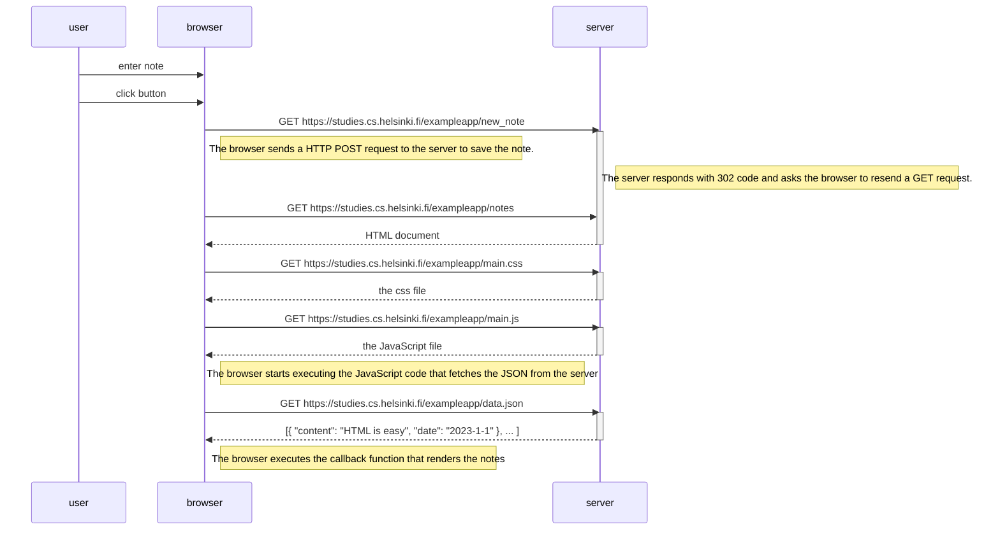

```mermaid
sequenceDiagram
    participant user
    participant browser
    participant server
    
    user->>browser: enter note
    user->>browser: click button
    browser->>server: GET https://studies.cs.helsinki.fi/exampleapp/new_note
    activate server
    
    Note right of browser: The browser sends a HTTP POST request to the server to save the note.
    Note right of server: The server responds with 302 code and asks the browser to resend a GET request.
    
    browser->>server: GET https://studies.cs.helsinki.fi/exampleapp/notes
    server-->>browser: HTML document
    deactivate server
    
    browser->>server: GET https://studies.cs.helsinki.fi/exampleapp/main.css
    activate server
    server-->>browser: the css file
    deactivate server

    browser->>server: GET https://studies.cs.helsinki.fi/exampleapp/main.js
    activate server
    server-->>browser: the JavaScript file
    deactivate server

    Note right of browser: The browser starts executing the JavaScript code that fetches the JSON from the server

    browser->>server: GET https://studies.cs.helsinki.fi/exampleapp/data.json
    activate server
    server-->>browser: [{ "content": "HTML is easy", "date": "2023-1-1" }, ... ]
    deactivate server

    Note right of browser: The browser executes the callback function that renders the notes
```
