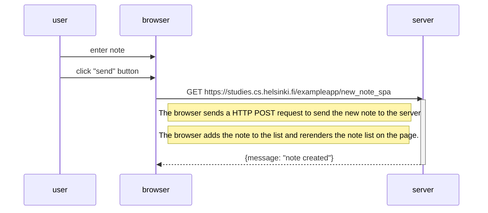

```mermaid
sequenceDiagram
    participant user
    participant browser
    participant server
    
    user->>browser: enter note
    user->>browser: click "send" button
    browser->>server: GET https://studies.cs.helsinki.fi/exampleapp/new_note_spa
    activate server
    
    Note right of browser: The browser sends a HTTP POST request to send the new note to the server
    Note right of browser: The browser adds the note to the list and rerenders the note list on the page.
    
    server-->>browser: {message: "note created"}
    deactivate server
```
